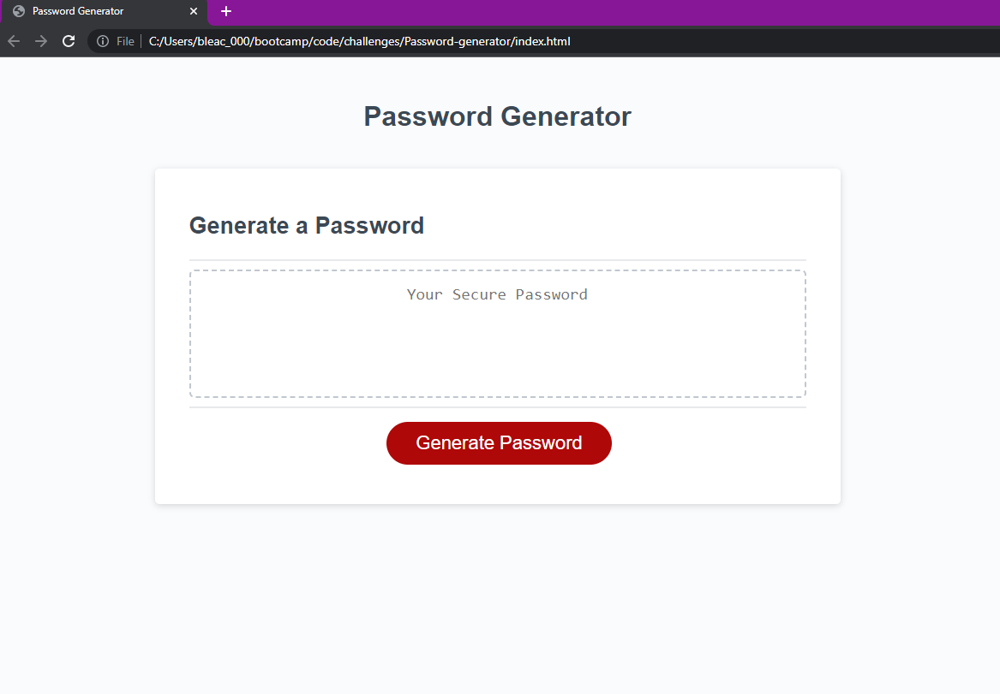

# <Password-generator>

## Description

with this application I would like to create a randomly generated password for the user.
In doing this I intend to make it possible to make a password of a lingth between 8-128 characters including uppercase letters, lowercase letters numbers, and symbols in any combination as requested by the user.

## Usage
 

## Deployment
  https://jessecolon.github.io/Password-Generator/
  
## Git Hub Repo
https://github.com/JesseColon/Password-Generator
